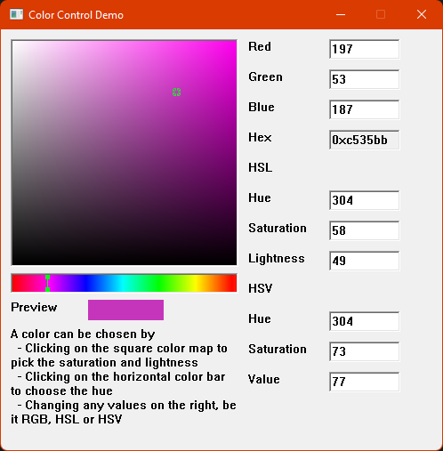

# ShigotoShoujin's Library
A collection of independent tools to nicely build fun win32 based applications.

# Why?
- To support other fun projects while still being on a professional level
- For the continuous learning experience

# Design Goals
- Fully using C++20 modules
- Fast and minimal memory footprint
- Windows only, using native controls

## Color Control Demo
- This demo was made as library milestone
- It was made before starting to use C++20 modules
- A color can be chosen by a combination of
  - Clicking on the square color map to pick the saturation and lightness
  - Clicking on the horizontal color bar to choose the hue
  - Changing any values on the right, be it RGB, HSL or HSV
- The point is this demo is to showcase what can be done with the library

## Next steps
- Continue working on the conversion toward using C++20 modules in the dev branch

## How to run
- Need the platform toolset version 143, included with Visual Studio 2022
- Set default project to ShigotoShoujinBoot or run the tests in ColorControlTest

## Contribute
Everyone's welcome to open issues, submit pull requests or otherwise manifest their existence.  
See [CONTRIBUTING.md](CONTRIBUTING.md)
